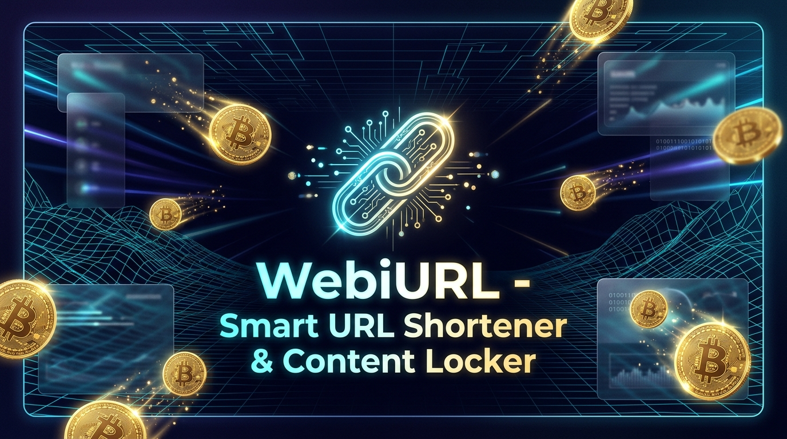
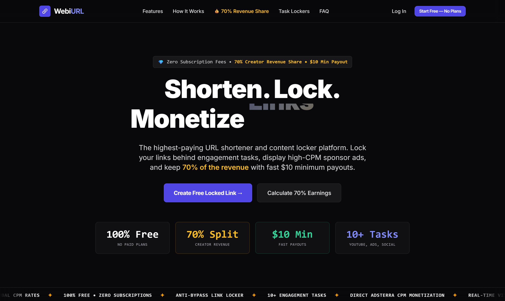
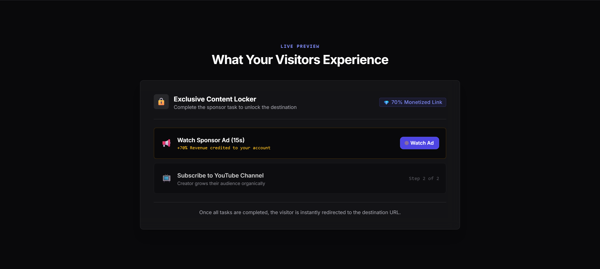
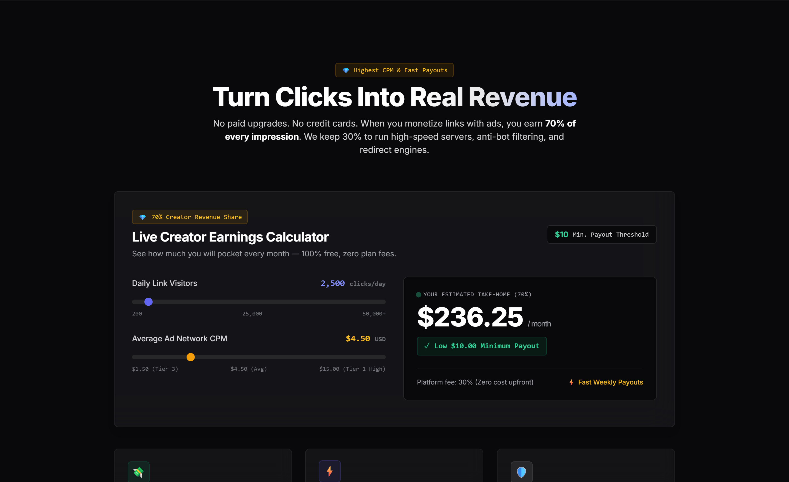
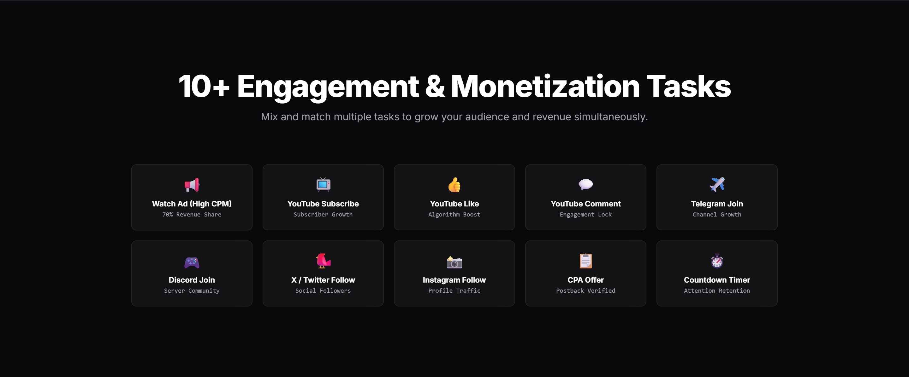
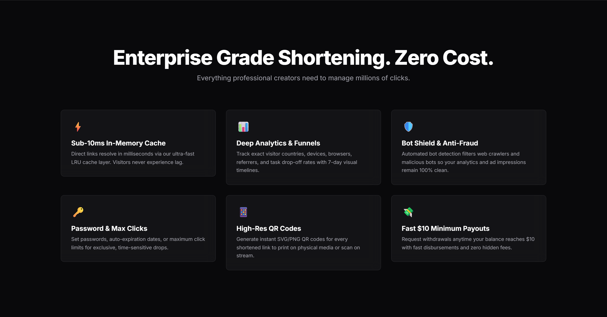
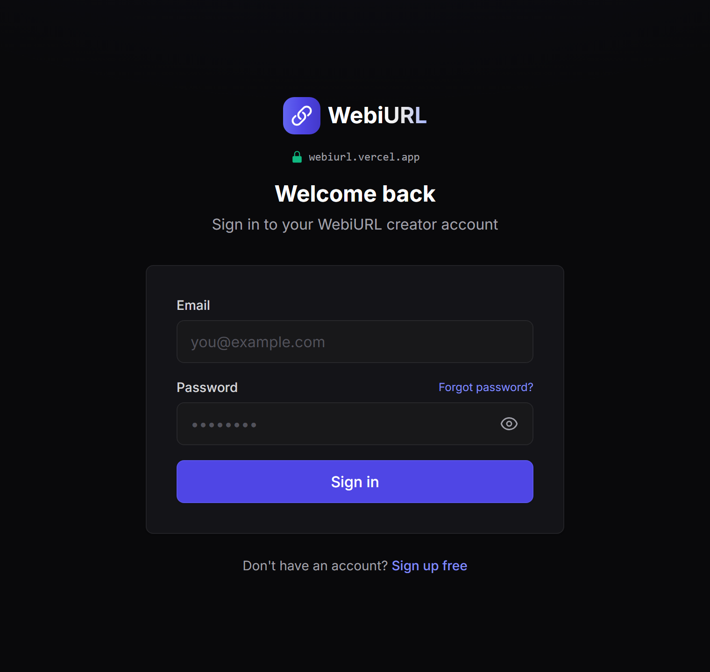
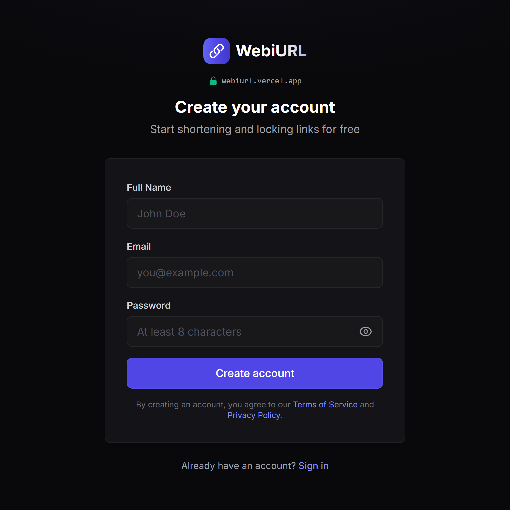

<p align="center">
  
</p>

<h1 align="center">🔗 WebiURL — Smart URL Shortener & Content Locker</h1>

<p align="center">
  <b>The modern URL shortener and monetization platform built for creators, marketers, and developers.</b><br />
  Lock links behind high-engagement sponsor tasks, maximize click earnings with high-CPM ad integration, and pocket <b>70% creator revenue share</b> with fast <b>$10 minimum payouts</b>.
</p>

<p align="center">
  <a href="https://webiurl.vercel.app"></a>
  
  
  
  
  
</p>

> [!IMPORTANT]
> **Proprietary & Closed-Source Platform**: This repository serves as the official public documentation, feature showcase, and architecture overview for [WebiURL](https://webiurl.vercel.app). The core application source code, monetization engines, and anti-bypass modules are proprietary and closed-source.

---

## 🌐 Live Application

Experience the live application deployed on Vercel:  
👉 **[https://webiurl.vercel.app](https://webiurl.vercel.app)**

---

## ⚡ Highlights & Key Differentiators

- 💎 **70% Creator Revenue Share**: Industry-leading revenue share on monetized links and sponsored tasks. We keep only 30% to run high-speed servers and anti-bot routing.
- 💸 **$10 Fast Minimum Payouts**: Low withdrawal threshold with prompt processing and transparent real-time balance tracking.
- ⚡ **Sub-10ms LRU Cache**: Fast, low-latency direct link resolution with an in-memory caching layer.
- 🛡️ **Anti-Bypass & Bot Shield**: Proprietary anti-crawler algorithms, IP verification, and cookie validation filter fraudulent traffic and keep impressions 100% clean.
- 🎯 **10+ Engagement & Monetization Tasks**: Lock content behind video ads, YouTube actions (Subscribe, Like, Comment), social joins (Telegram, Discord, X/Twitter, Instagram), CPA offers, and countdown timers.
- 📊 **Deep Funnel Analytics**: Interactive visual charts tracking visitor countries, device types, browser clients, referrers, and unlock drop-off funnels.
- 📱 **Instant QR Code Engine**: Generate downloadable high-resolution SVG and PNG QR codes for real-world print or livestream placement.
- 🔒 **Enterprise-Grade Link Security**: Password protection, custom aliases, click caps, and expiration timestamps.

---

## 📸 Visual Tour & Screenshots

### 1. Landing & Value Proposition
Clean, dark-mode design built with kinetic typography, infinite marquee ticker, and live trust metrics.

<p align="center">
  
</p>

---

### 2. Interactive Content Locker Experience
A live simulation displaying the multi-step verification process required before destination URLs unlock.

<p align="center">
  
</p>

---

### 3. Live Creator Earnings Calculator
Interactive calculator allowing creators to estimate monthly revenue based on traffic volume and ad network CPMs.

<p align="center">
  
</p>

---

### 4. 10+ Engagement & Social Tasks
Mix and match tasks to grow social channels and maximize advertising revenue per link click.

<p align="center">
  
</p>

---

### 5. Enterprise-Grade Features Grid
High-performance infrastructure powering link redirection, analytics, security, and QR code generation.

<p align="center">
  
</p>

---

### 6. Seamless Authentication
Secure user login and account onboarding with built-in password visibility toggles and session management.

<p align="center">
  
  
</p>

---

## 🎯 Supported Task Types

| Task Type | Category | Description | Benefit |
| :--- | :--- | :--- | :--- |
| **Watch Ad** | Monetization | Displays high-CPM direct sponsor ad | **70% Revenue Credited** |
| **YouTube Subscribe** | Social Growth | Directs visitor to subscribe to YouTube channel | Channel subscriber growth |
| **YouTube Like** | Engagement | Requires liking a specified video | Algorithm boost |
| **YouTube Comment** | Engagement | Requires leaving a comment on target video | Engagement signal boost |
| **Telegram Join** | Community | Directs visitor to join a Telegram group/channel | Direct follower community |
| **Discord Join** | Community | Invites visitor to enter a Discord community | Gaming / Tech community |
| **X / Twitter Follow** | Social Growth | Directs visitor to follow an X account | Audience amplification |
| **Instagram Follow** | Social Growth | Directs visitor to follow an Instagram profile | Visual content reach |
| **CPA Offer** | Monetization | Requires completion of a partner CPA action | High payout per lead |
| **Countdown Timer** | Retention | Enforces a reading / retention delay | View duration retention |

---

## 🛠️ Technology Stack

- **Frontend**: [Next.js 14](https://nextjs.org/) (App Router, Turbopack, Route Handlers), React 18
- **Language**: [TypeScript 5.5](https://www.typescriptlang.org/)
- **Styling**: [Tailwind CSS 3.4](https://tailwindcss.com/) with dark-mode design system tokens
- **Database & Auth**: [Supabase](https://supabase.com/) (PostgreSQL, Row Level Security, SSR client)
- **State Management**: [Zustand](https://github.com/pmndrs/zustand)
- **Charts & Data Visualization**: [Recharts](https://recharts.org/)
- **Caching**: In-Memory LRU Cache (`lru-cache`)
- **QR Code Engine**: `qrcode` (SVG & PNG generation)
- **Device & Browser Detection**: `ua-parser-js`
- **Security & Cryptography**: `crypto-js`, `bcryptjs`, `nanoid`
- **Infrastructure & Hosting**: [Vercel](https://vercel.com/)

---

## 📂 System Architecture Overview

```
webiurl/
├── docs/
│   └── screenshots/              # High-resolution application screenshots
├── src/
│   ├── app/
│   │   ├── [code]/               # Dynamic URL redirector & unlock controller
│   │   ├── admin/                # Platform administration & payout overview
│   │   ├── api/                  # Route handlers (links, analytics, auth)
│   │   ├── auth/                 # Supabase auth callbacks & session handlers
│   │   ├── dashboard/            # Creator dashboard (links, analytics, earnings)
│   │   ├── login/                # Creator authentication login
│   │   ├── signup/               # Creator onboarding registration
│   │   ├── privacy/              # Privacy policy documentation
│   │   ├── terms/                # Terms of service documentation
│   │   └── page.tsx              # High-converting landing page
│   ├── components/
│   │   ├── admin/                # Admin panels & user management tables
│   │   ├── auth/                 # Sign-in and Sign-up form cards
│   │   ├── dashboard/            # Link management, table, sidebar, stats
│   │   ├── landing/              # Hero, marquee, FAQ, earnings calculator
│   │   ├── ui/                   # SpotlightCard, ScrollReveal, badges, buttons
│   │   └── unlock/               # Task verification engine & unlock screens
│   ├── lib/
│   │   ├── cache.ts              # LRU in-memory link caching system
│   │   ├── security.ts           # IP hashing, cookie HMAC verification
│   │   └── supabase/             # Supabase browser, server, and admin clients
│   └── types/                    # TypeScript interfaces & database schemas
└── supabase/                     # SQL migration scripts & schema definitions
```

---

## 🔒 Security & Fraud Prevention

- **HMAC Cookie Signing**: Prevents visitors from manipulating unlock status cookies or bypassing monetization steps.
- **Anonymized IP Hashing**: Salted IP hashes prevent duplicate click inflation while safeguarding visitor privacy and GDPR compliance.
- **Row Level Security (RLS)**: Fine-grained PostgreSQL RLS rules ensure creators can only view and manage their own links and earnings.
- **Timing & Bot Checks**: Prevents automated scripts from instantly passing verification checkpoints.

---

## 🚀 Accessing the Platform

WebiURL is a hosted software-as-a-service (SaaS) platform:

1. Visit **[https://webiurl.vercel.app](https://webiurl.vercel.app)**
2. Click **Create Free Locked Link** or **Start Free**
3. Create your short links, configure engagement tasks, and start earning **70% revenue share** right away!

---

## 📄 License & Proprietary Notice

**Copyright © 2026 Md Saim. All Rights Reserved.**

This software, documentation, and all associated assets are **strictly proprietary and closed-source**. 
- **No License Granted**: No license, permission, or right is granted to copy, distribute, modify, merge, publish, sublicense, or sell this software or any portion of its code.
- **Unauthorized Use Prohibited**: Unauthorized copying, reproduction, reverse engineering, scraping, or redistribution via any medium is strictly prohibited.
- For business inquiries, partnerships, or licensing, please contact the author directly.

---

<p align="center">
  <b>Built with care by <a href="https://github.com/Md-Saim">Md Saim</a></b>
</p>
